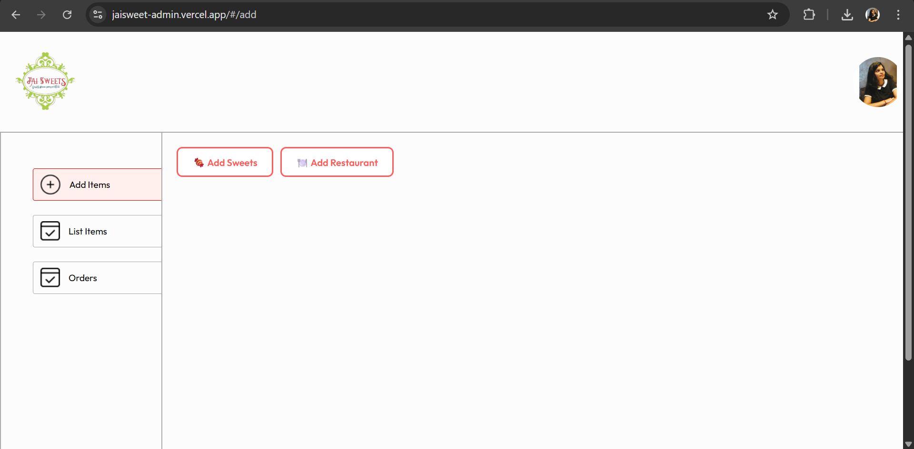
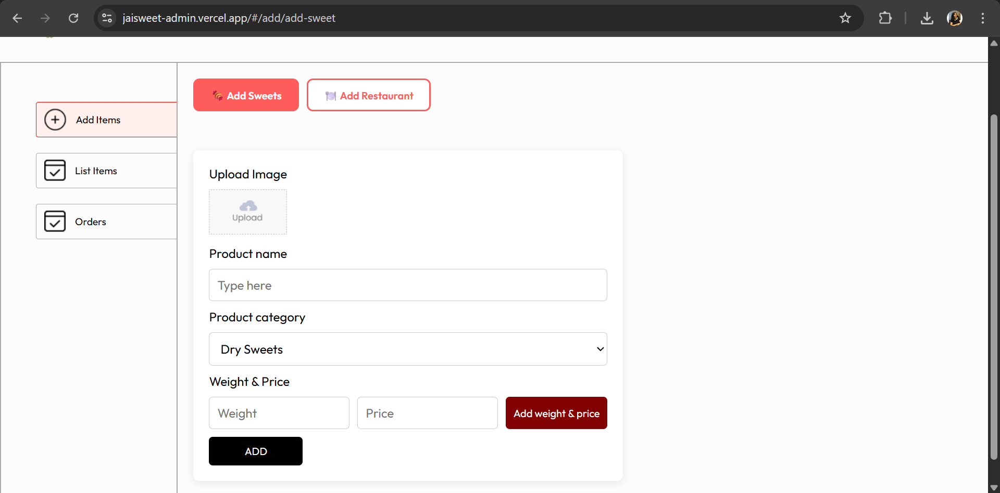
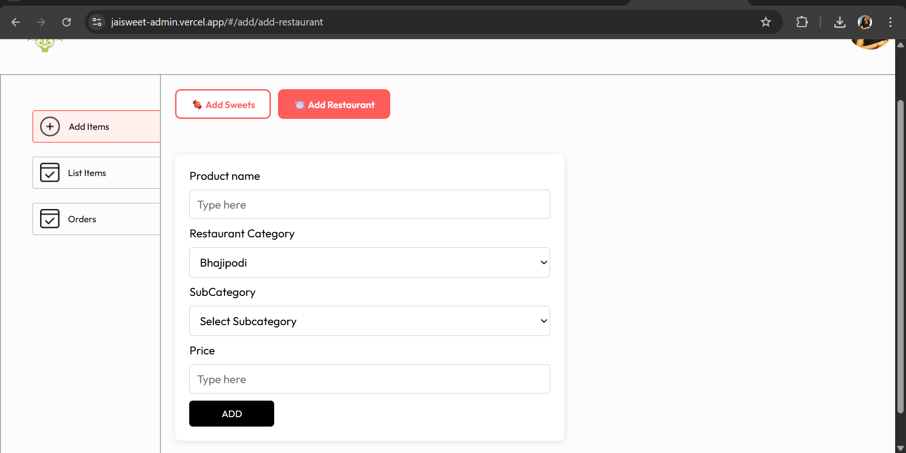
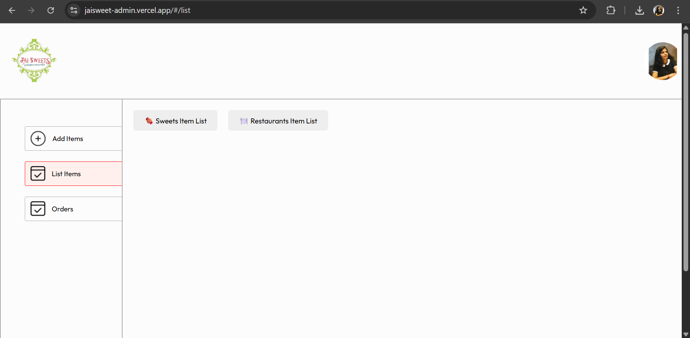
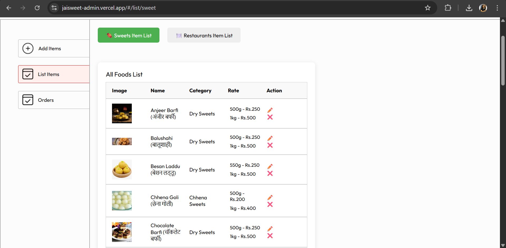
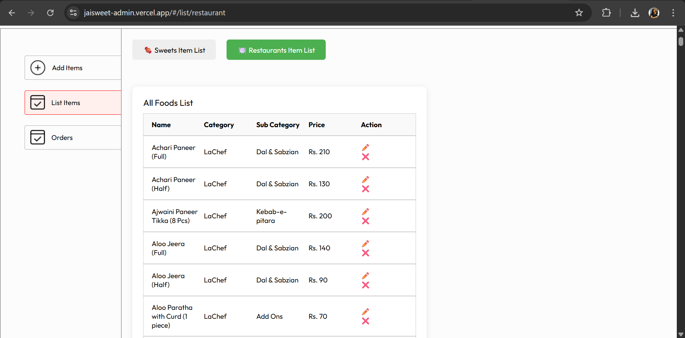
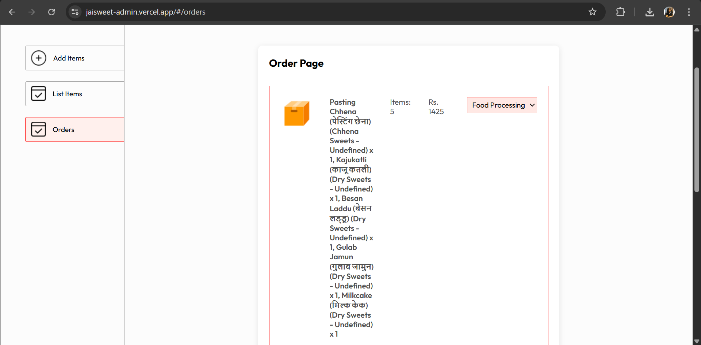

# 🎛️ JaiSweet Admin Panel

The **JaiSweet Admin Panel** is a dedicated web interface for shop owners and admins to manage sweets, restaurants, and customer orders efficiently.

This panel powers the backend of the JaiSweet e-commerce platform — enabling real-time item management and order tracking.

---

## 🔗 Live Demo

[👉 View Link ](https://jaisweet-admin.vercel.app/)

---

## ✨ Features

- 🍬 **Add & Manage Sweets**
  - Add sweet items with image, price, description, weight and category
  - Edit and delete existing sweets
  - View complete list of all sweets

- 🏪 **Add & Manage Restaurants**
  - Add restaurant profiles with name, type, category, subcategory and price
  - Edit and delete existing restaurants items
  - View and manage list of restaurants items

- 📦 **Orders Management**
  - View incoming orders with user details, item list, and status
  - Track and update order status (Pending, Preparing, Delivered, etc.)

---

## 🧱 Tech Stack

- **Frontend Framework:** React.js 
- **UI Framework:** Tailwind CSS
- **State Management:** Context API 
- **API Communication:** Axios and Fetch
- **Backend (Connected):** Node.js and Express

---

## Screenshots

To provide a better understanding of the Student Study Portal application, here is a screenshot:

##Add Interface

##Add_sweet Interface

##Add_restaurant Interface

##List Interface

##List_sweet Interface

##Order Interface

